# labReservation
### 该系统主要实现了教师根据教学的实际情况进行教学以外的实验室开放，发布以及管理学生预约的开放时间，学生查询实验室预约信息、预约开放实验室，系统自动审核学生的预约请求，并为教师生成图表分析实验室的实时使用情况，系统定时检验学生预约状态自动发送邮件通知。

## 主页功能
### 实验室近一个月预约时间自动显示：
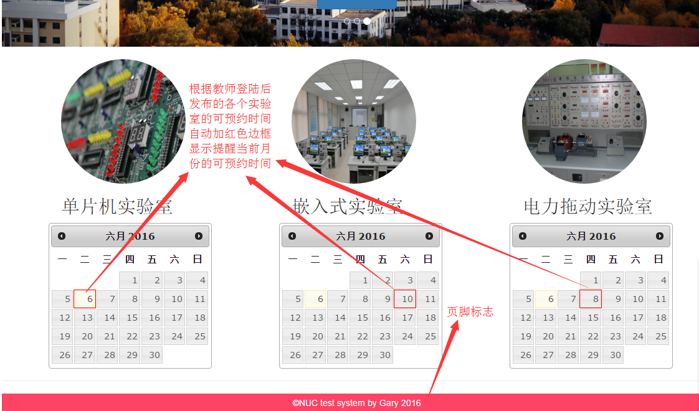

### 教师与学生登录：
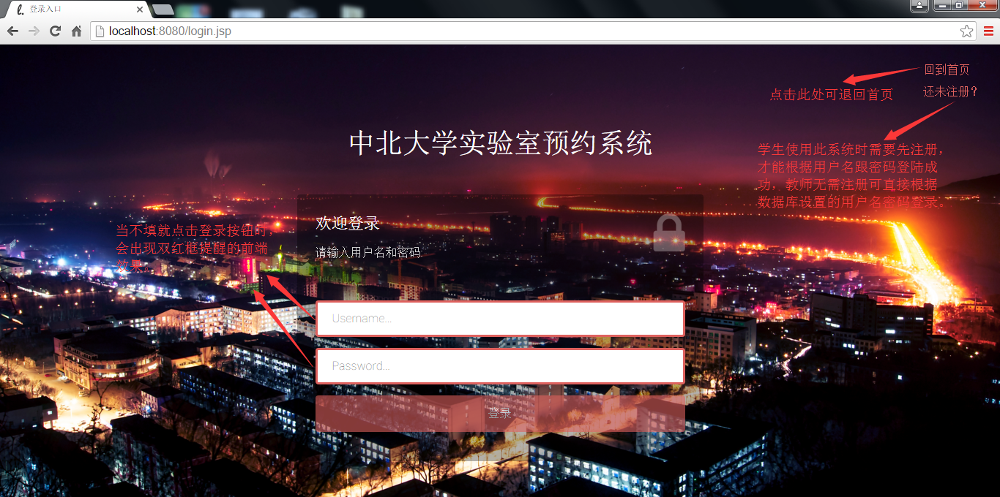

### 注册：
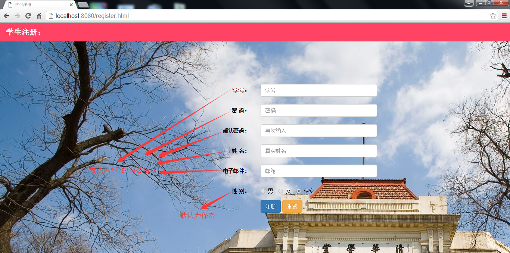

## 教师发布与管理实验室预约信息等功能
### 信息发布与查询：

### 实验室预约信息添加：

### 实验室预约信息导出Excel表：

### 一键导出学生签到表：
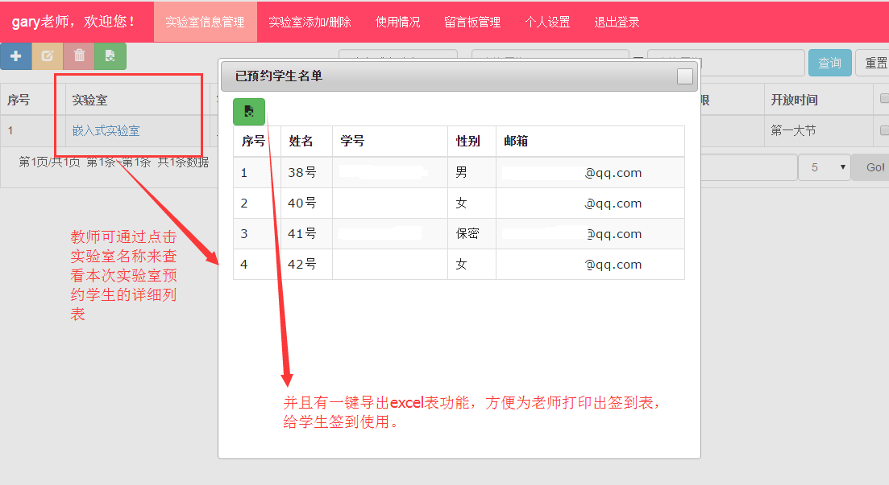
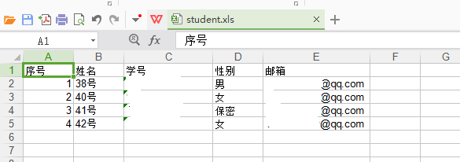

### 实验室添加与删除：

### 预约人数饼状图实时分析：

### 留言板管理：

## 学生实验室预约与查询等功能
### 实验室预约与查询：
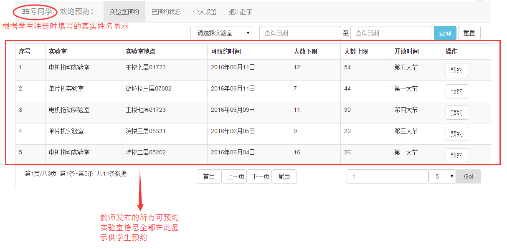

### 实验室预约状态查询：
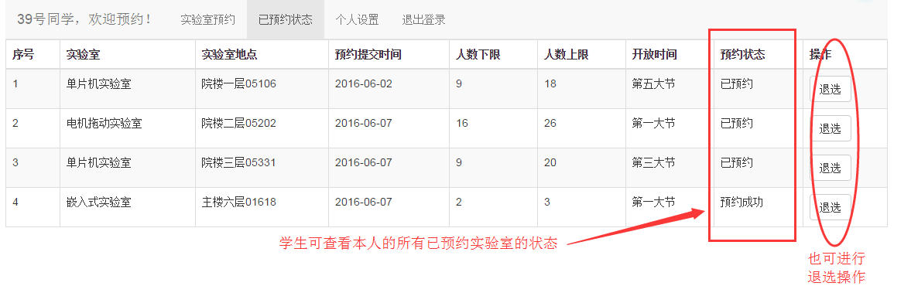

## 系统管理功能
### 学生预约状态自动审核：
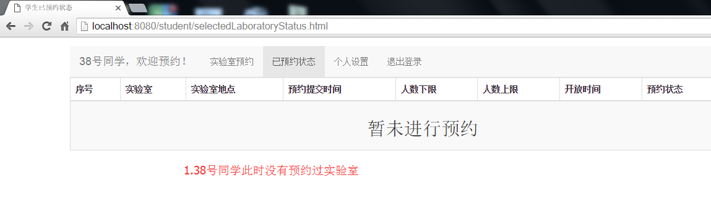
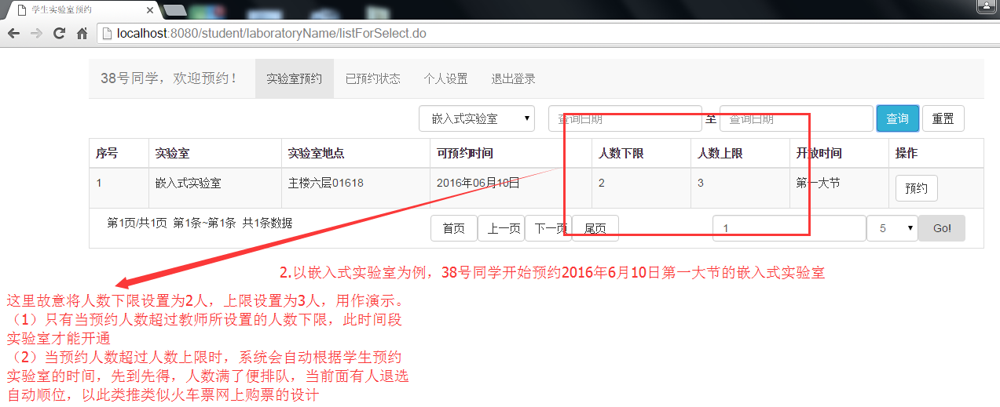

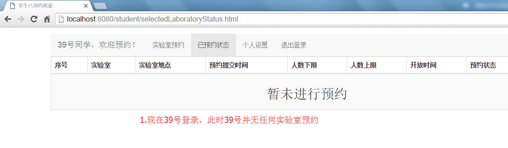
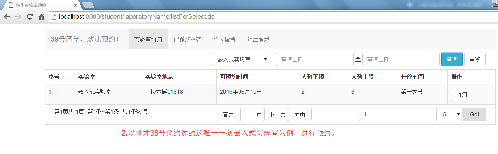
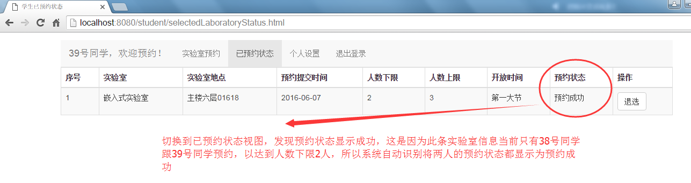
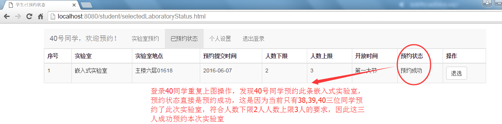
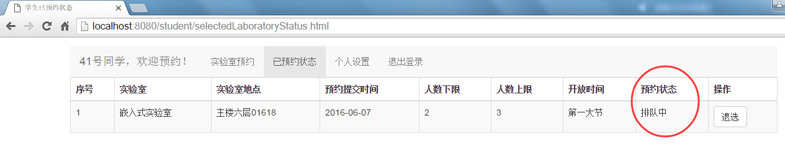

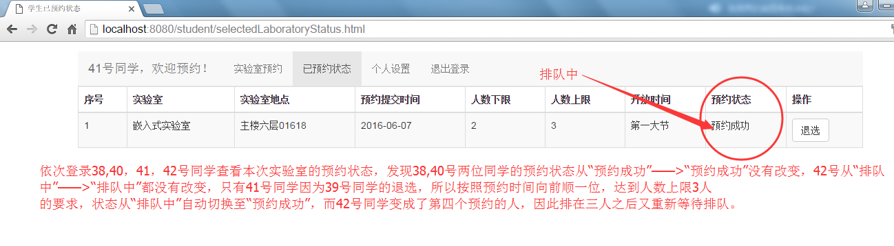
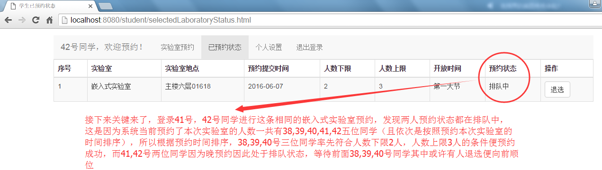

## 自动发送邮件通知功能
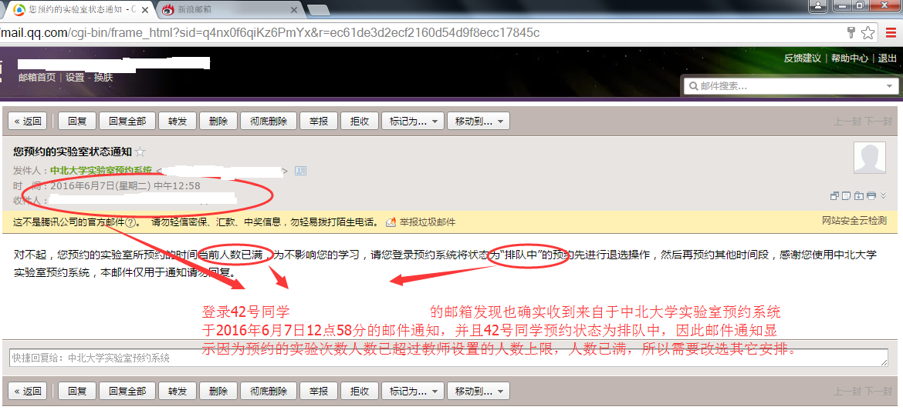

## 注：
### pom文件中使用了一个第三方组件，地址：[forten-utils](https://github.com/2016gary/forten-component "forten-utils")
